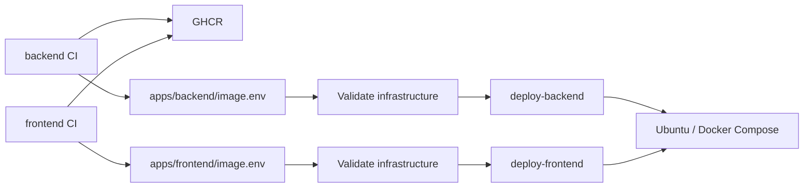

# AgroZanjir production

Three repositories, one Ubuntu server, one domain. Apps publish immutable images
and update their own image file in this repo. Only infra connects to the server.



## Layout

- `compose.yaml`: PostgreSQL 18, Redis, Caddy and private networks.
- `Caddyfile`: HTTPS/HTTP3 and same-origin routing.
- `apps/backend/` and `apps/frontend/`: each has its own Compose fragment,
  `image.env` desired digest reference and `deployed.json` successful receipt.
- `scripts/remote.sh`: runner transport with pinned SSH host keys.
- `scripts/bootstrap.sh`: prepare Ubuntu; no app images required.
- `scripts/deploy.sh`: replace one app, verify and recover on failure.
- `scripts/backup.sh` and `restore.sh`: optional encrypted offsite backup/restore.
- `postgres/10-app.sh`: restricted application database role.

Server files live in `/opt/agrozanjir`. Generated secrets live in private `runtime/`;
Git contains none. PostgreSQL 18 mounts a persistent named volume at
`/var/lib/postgresql`. Media and Caddy certificates persist under `data/`.
Redis is shared and persistent. Only Caddy publishes ports. Backend, frontend and
Caddy have non-root users, read-only root filesystems and dropped capabilities.
Stock PostgreSQL/Redis entrypoints prepare volumes as root, then drop privileges.

| Route | Service |
| --- | --- |
| `/`, SPA deep links, `/admin/*` | frontend |
| `/api/v1/*` | Django, prefix preserved |
| `/django-admin/` | Django administration |
| `/static/*` | Django/WhiteNoise, collected during image build |
| `/media/*` | persistent uploads served by Caddy |
| `/healthz` | frontend health |

**Media links are public: anyone possessing a URL can download the file without
signing in. Random filenames are not authorization.** This retains pilot behavior;
implement authenticated downloads before uploading sensitive documents. Directory
listing is disabled; accepted uploads cannot execute as code.

## One-time GitHub setup

1. Create `prod` environments in **backend, frontend and infra**. Restrict deployment
   branches to `main`. Reviewers are optional; if enabled, approve within the app's
   45-minute infra wait deadline.
2. Create an AgroZanjir-owned **GitHub App**, installed on **infra only**, with
   repository **Contents: read/write**, **Actions: read/write**, Metadata read. No webhooks
   or organization permissions needed. Generate a private key. Short-lived App
   tokens trigger infra push workflows; ordinary GITHUB_TOKEN commits do not.
   Existing installations must approve the Actions write permission so source
   deploy retries can dispatch a fresh infra run without rebuilding the image.
3. Put the App ID/private key in all three prod environments. Give the App a narrow
   bypass of infra/main rules if rules block its direct image/state commits.
4. Permit Actions package publication/deletion in organization policies. After each
   package's **first publish**, set GHCR visibility **Private**, link the package to
   its source repo, and add **AgroZanjir/infra: Read** under **Manage Actions access**.
   The source app repo needs **Admin** Actions package access for deletion. If the
   first release fails before this access exists, configure it and rerun the release.
5. Configure infra/prod below. Commit/push the implementation in its respective
   repos. Bootstrap before app releases. Initial infra pushes may trigger a deploy
   before bootstrap; rerun deploy-infra afterward. Initial empty image files are
   intentional; app CI replaces them after a successful build/scan.

| Repo / prod | Secrets | Variables |
| --- | --- | --- |
| backend | `INFRA_APP_PRIVATE_KEY` | `INFRA_APP_ID` |
| frontend | `INFRA_APP_PRIVATE_KEY` | `INFRA_APP_ID` |
| infra | `INFRA_APP_PRIVATE_KEY`, `VPS_HOST`, `VPS_USERNAME`, `VPS_SSH_KEY`, `VPS_SSH_KNOWN_HOSTS`, `DJANGO_SECRET_KEY`, `POSTGRES_ADMIN_PASSWORD`, `POSTGRES_PASSWORD`, `REDIS_PASSWORD` | `INFRA_APP_ID`; optional settings below |

GITHUB_TOKEN is automatic. **All runtime secrets/variables belong to infra/prod.**
App repos have no server credentials. Production frontend needs no build variables:
API requests use relative `/api/v1/` URLs. Optional `ANTHROPIC_API_KEY` is an infra
secret; without it the assistant reports unavailable.

Use independent random database/cache passwords (20+ characters). Django's key
must have 50+ characters and 5+ distinct characters. Single-line `$`, quotes and `#`
are preserved as raw values; connection URL passwords are percent-encoded.
Database admin and application passwords must differ. Existing PostgreSQL volumes
keep their role passwords: do not rotate only the GitHub secret. Rotate roles and
secrets together in a maintenance window. Redis rotation requires a Redis restart
and backend redeployment.

| Optional variable | Default / use |
| --- | --- |
| `DOMAIN` | `agrozanjir.uz` |
| `VPS_SSH_PORT` | `22` |
| `GUNICORN_WORKERS`, `GUNICORN_THREADS` | `2`, `4` |
| `GUNICORN_TIMEOUT`, `GUNICORN_GRACEFUL_TIMEOUT` | `120`, `30` seconds |
| `STARTUP_TIMEOUT` | `60` seconds, database/cache startup wait |
| `SEEDED_PASSWORDS_ROTATED` | `False`, assert only after rotating pilot accounts |
| `ASSISTANT_ADAPTER` | `auto` |
| `ASSISTANT_MODEL`, `ASSISTANT_EFFORT`, `ASSISTANT_PANEL_EFFORT`, `ASSISTANT_MAX_TOKENS`, `ASSISTANT_FALLBACKS` | backend defaults |
| `ASSISTANT_BURST_RATE`, `ASSISTANT_HOUR_RATE`, `ASSISTANT_PANEL_RATE`, `ENQUIRY_BURST_RATE`, `ENQUIRY_DAY_RATE`, `SIGNIN_ADDRESS_RATE`, `SIGNIN_ACCOUNT_RATE` | backend defaults |
| `ACCESS_TOKEN_MINUTES`, `REFRESH_TOKEN_DAYS`, `SECURE_HSTS_SECONDS` | backend defaults |

After updating runtime settings dispatch deploy-backend with operation `deploy`.
Shared configuration changes trigger deploy-infra; image files do not trigger it.

## First server

Recommended: fresh **Ubuntu 24.04 LTS amd64**. Bootstrap also accepts 22.04/26.04 LTS.
Create the non-root deployment account manually before running any workflow,
as in YuCRM. Both bootstrap and releases connect as `VPS_USERNAME`, e.g. `deploy`,
using `VPS_SSH_KEY`. Bootstrap requires passwordless sudo on this existing account;
it never creates login users, installs authorized keys or changes sudo grants.

For a dedicated Actions key, run this in Windows PowerShell and leave its passphrase
empty at the prompts (the unattended workflow cannot unlock a passphrase):

```powershell
ssh-keygen -t ed25519 -f "$env:USERPROFILE\.ssh\agrozanjir-actions-prod" -C "agrozanjir-actions-prod"
Get-Content "$env:USERPROFILE\.ssh\agrozanjir-actions-prod.pub"
```

Log into the server with your existing root/operator credentials. Run the following
as root, replacing the placeholder with the complete **public** key printed above.
The user creation is skipped if `deploy` already exists; existing keys are retained.

```bash
id deploy >/dev/null 2>&1 || adduser --disabled-password --gecos '' deploy
deploy_home=$(getent passwd deploy | cut -d: -f6)
deploy_group=$(id -gn deploy)
install -d -m 0700 -o deploy -g "$deploy_group" "$deploy_home/.ssh"
cat >>"$deploy_home/.ssh/authorized_keys" <<'KEY'
PASTE_THE_COMPLETE_SSH_PUBLIC_KEY_HERE
KEY
chown "deploy:$deploy_group" "$deploy_home/.ssh/authorized_keys"
chmod 0600 "$deploy_home/.ssh/authorized_keys"
printf '%s\n' 'deploy ALL=(ALL) NOPASSWD:ALL' >/etc/sudoers.d/agrozanjir-deploy
chmod 0440 /etc/sudoers.d/agrozanjir-deploy
visudo -cf /etc/sudoers.d/agrozanjir-deploy
```

This deliberately grants `deploy` full passwordless sudo, matching YuCRM. Treat its
key as an administrator credential and keep it only in **infra/prod**. Docker group
access added by bootstrap is also root-equivalent. Your root account and authorized
keys remain intact; use a separate root key for your terminal and keep it outside GitHub.

Before dispatching bootstrap, test from Windows:

```powershell
ssh -i "$env:USERPROFILE\.ssh\agrozanjir-actions-prod" -p 22 deploy@YOUR_VPS_HOST "sudo -n true && echo ready"
```

In **infra → Settings → Environments → prod**, set these secrets:

- `VPS_USERNAME`: `deploy`.
- `VPS_HOST`: your server address.
- `VPS_SSH_KEY`: the full private key file, including its BEGIN/END lines.
- `VPS_SSH_KNOWN_HOSTS`: the independently verified server host-key line below.

Set variable `VPS_SSH_PORT` only if it differs from `22`. The old bootstrap username
variable is no longer used and can be deleted. Root credentials are not needed in GitHub.

Obtain the SSH host fingerprint/key from the provider console or another trusted
channel. VPS_SSH_KNOWN_HOSTS contains independently verified known_hosts line(s)
for exact VPS_HOST; use `[host]:port` for nonstandard ports. Do not blindly trust
network ssh-keyscan output. Strict verification is required.

For example, in a trusted root/operator session (substitute the exact `VPS_HOST`):

```bash
ssh-keygen -lf /etc/ssh/ssh_host_ed25519_key.pub
awk -v host='YOUR_VPS_HOST' '{print host, $1, $2}' /etc/ssh/ssh_host_ed25519_key.pub
```

The host key identifies the **server**; it is different from the deploy login key.

1. Point DNS **A** to the server's IPv4. Add **AAAA** only for working provider-routed
   IPv6. Allow TCP 80/443, UDP 443, SSH TCP and ICMPv6 in provider firewalls.
2. Run **server bootstrap** on main. It installs Docker/Compose, prepares
   persistence, IPv6/QUIC buffers, host/Docker firewall rules and maintenance timers.
   It checks deploy's passwordless sudo before staging files and verifies Docker
   access in a fresh SSH session afterward. SSH passwords are disabled, while
   `PermitRootLogin prohibit-password` keeps **root login with existing keys** working.
   Bootstrap needs no Django/database secrets or app images.
3. Run **deploy-infra** to initialize PostgreSQL, Redis and Caddy.
4. Push/dispatch each app CI on main. Configure private package access after first
   publish. Apps wait for their matching infra deployment before registry cleanup.
5. Seed reference data and create your administrator using the commands below.
   Check website, sign-in, Django admin and both health endpoints.

Caddy renews certificates and enables HTTP/1.1, HTTP/2 and HTTP/3 with Alt-Svc.
QUIC requires end-to-end UDP 443. Docker's private IPv6 subnet does not give the
VPS public IPv6: provider routing and AAAA must work. Initial setup expects direct
DNS to the VPS; a CDN must explicitly support QUIC and the origin configuration.
Bootstrap is for dedicated machines and changes Docker, firewall and SSH settings.
It preserves existing daemon JSON settings and can be rerun. Moving servers also
requires transferring/restoring database, media and certificate data.
Rerun bootstrap with the same deploy account and its manually configured sudo grant.
Root key login on the existing SSH port remains available for operator administration.
If you ran the previous bootstrap version, first configure deploy's full sudo grant
from an existing administrator session/provider console using the commands above.
The corrected bootstrap replaces the previous root-blocking SSH drop-in.

## Release and recovery

Three parallel source security gates (Gitleaks, Semgrep, Trivy), then tests,
build/publish, Trivy image scan, infra update/deployment wait, and cleanup-ghcr.
PRs build and scan without publishing or contacting infra. Tags are
`backend-<full-source-sha>-<run-id>-<attempt>` or the frontend equivalent and desired
references include `@sha256:<digest>`. No mutable latest tags; rebuilds get new names.

All server mutations share one GitHub queue and server flock. Apps replace only
their own fragment/service; shared configuration has a separate workflow. Stale
runs refuse superseded desired images/config. Backend waits for PostgreSQL/Redis,
checks strict production settings, migrates, and starts Gunicorn. Django admin
static is baked into its image. No automatic demo seeds; OneID stub is disabled.
App tests run against disposable PostgreSQL 18/Redis in CI.

Every backend, frontend, shared-infra deployment and server bootstrap runs
infrastructure validation first within the same workflow run. The server job
requires validation to succeed; failed or cancelled checks skip deployment.
Validation also runs independently on pull requests, but has no separate push run.
The reusable validation workflow checks the same commit as its caller.

Rerunning a source deploy job reuses the already-published immutable image. If its
desired image file is unchanged, the source dispatches a new app deployment from
infra/main and waits for the returned run ID and its exact receipt. The requested
image is checked before server access so a superseded retry cannot deploy another
release. Source deploy and image-scan jobs use `!cancelled()` so cancellation can
stop them. A missing push run fails after two minutes instead of waiting 45 minutes.

Compose has a brief app restart. Success requires container readiness and external
HTTPS probes (including Django admin CSS). Infra publishes a secret-free receipt
both to Git and server state. App CI verifies exact infra commit/run/attempt before
cleanup. Cleanup deletes **all other package versions across all pages**, retaining
current/previous release indexes plus their platform and attestation manifests.
Stale cleanup reruns skip deletion. Failed image scans/deployments never clean up;
failed build versions disappear on the next successful release. Use these packages
only for their respective app. No deployment script globally prunes server images.

Failed deployments restore the old app image/config; successful state remains
unchanged. Failed first releases stop the app. A failure after server verification
but before the Git state commit may require an infra deploy rerun to reconcile the
receipt; cleanup waits for that success.
Failed shared deployments also restore their previous Compose, Caddy, scripts and
runtime files and try to recover the shared services.

Dispatch deploy-backend/deploy-frontend with `operation=rollback` to commit a retained
working image through the same normal trigger. No arbitrary tag input. After an
automatic recovery it first reconciles desired Git state to the current working
image. **Image rollback never reverses migrations.** Keep migrations compatible
with the preceding image; destructive changes require a separately tested restore.

## Operations

SSH as the deployment user:

```bash
cd /opt/agrozanjir
source scripts/common.sh
COMPOSE_APP=backend compose ps
COMPOSE_APP=backend compose logs --tail 100 backend
COMPOSE_APP=backend compose exec backend python manage.py seed_reference
COMPOSE_APP=backend compose exec backend python manage.py createsuperuser
COMPOSE_APP=frontend compose logs --tail 100 frontend
```

Never run seed_demo/seed_accounts on a fresh production database. Existing pilot
accounts with usable passwords block startup until rotated and
SEEDED_PASSWORDS_ROTATED=True is asserted. Daily token maintenance runs at 03:00
Asia/Tashkent. Database application role is not a superuser.
**Never run `docker compose down --volumes` on production.** Monitor disk usage,
application logs, workflow failures and backup timers.

## Optional encrypted S3 backups

Store in infra/prod:

| Type | Names |
| --- | --- |
| Variables | `RESTIC_REPOSITORY` e.g. `s3:https://s3.example.com/bucket/agrozanjir`, `AWS_DEFAULT_REGION` (default us-east-1) |
| Secrets | `RESTIC_PASSWORD`, `AWS_ACCESS_KEY_ID`, `AWS_SECRET_ACCESS_KEY` |

Create bucket/prefix first and scope credentials to it. Keep RESTIC_PASSWORD securely
outside the VPS. Restic encrypts database dumps and media before upload. Missing or
partial settings **disable backups without blocking bootstrap/deploy**. Complete
but broken configuration fails visibly. Updates to an already-deployed backend
back up before migrations; a configured backup failure blocks the replacement.
Dumps and media are sequential, not an atomic cross-resource snapshot; use a write
maintenance window if strictly consistent snapshots are required.

Daily 02:30 Asia/Tashkent backups retain 7 daily, 4 weekly and 6 monthly snapshots;
Sunday 03:30 integrity checks run restic check. Inspect with
`systemctl list-timers 'agrozanjir-*'` and `journalctl -u agrozanjir-backup.service`.

```bash
cd /opt/agrozanjir
bash scripts/backup.sh
python3 scripts/restic_cmd.py snapshots
# Deliberate destructive operator action: restores database AND media with backend stopped.
sudo bash scripts/restore.sh <snapshot-id-or-latest> --confirm-restore
```

The restore command requires sudo. Your manually provisioned deploy account can run
it, or you can use your root/operator session.

Test restore on a spare VPS. Restoring needs a compatible application schema and
runtime settings. A failed database restore keeps the backend stopped and preserves
restored files for inspection. New machine order: bootstrap, shared/runtime setup,
data restore, compatible app deployment. Lost RESTIC_PASSWORD means lost backups.

## Validation and maintenance

```bash
python3 -m unittest discover -s tests -v
shellcheck -x -P SCRIPTDIR scripts/*.sh
python3 tests/validate_compose.py
```

Real Bash failure-path tests use fake Docker/HTTPS clients. Compose validation uses
synthetic secrets and starts no services. The Ubuntu bootstrap's systemd/firewall/SSH
steps still need validation on your target VPS; container tests cannot certify
provider routing. Base images and Actions are digest/commit pinned: update deliberately
and rerun tests/scans. Frontend has a narrow expiring build-dependency exception
in its README and .trivyignore.yaml.

Implementation validation on 2026-10-04: 208 Django tests against PostgreSQL 18.6
and Redis, 122 frontend tests/typecheck, 10 release-safety tests per app and 12 infra
tests passed. Both builds and source/runtime HIGH/CRITICAL scans passed. HTTPS SPA,
API, Django admin/CSS, IPv6 frontend listener and a real HTTP/3 QUIC request passed
in an isolated local Compose stack. Stopping Redis produced a generic 503 and
restarting it restored readiness. PostgreSQL permission queries were corrected to
avoid DISTINCT/FOR UPDATE combinations that worked in SQLite but failed in PostgreSQL.
The live GitHub/VPS rollout and provider IPv6 routing await environment setup;
bootstrap has not been executed on a production Ubuntu host.
